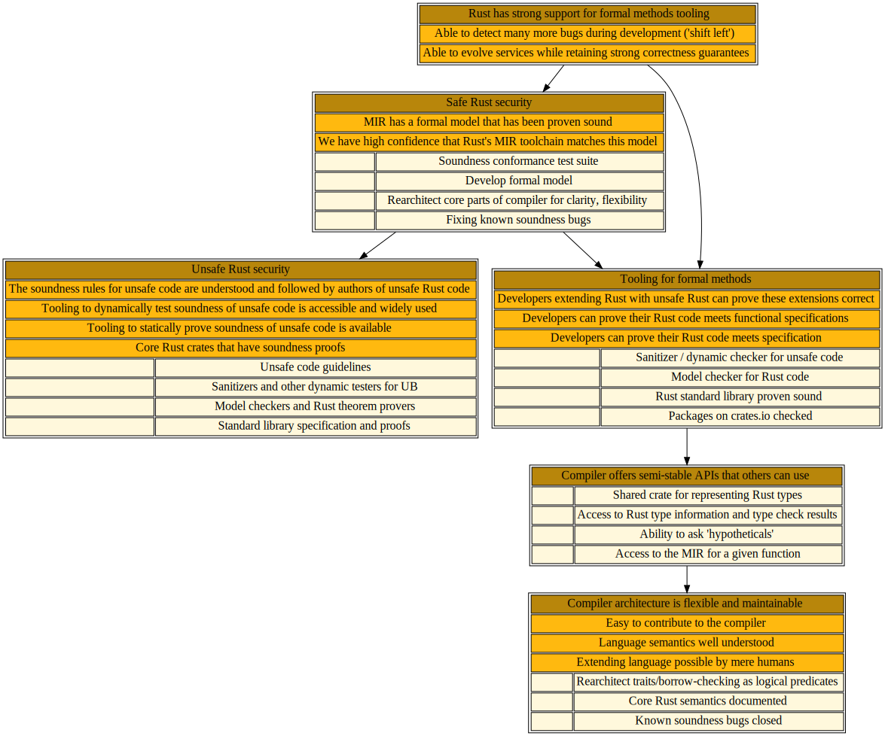

# 🎯 Rust programs meet the highest standard of correctness

## Shiny future

XXX

## Status quo as of January 2022

XXX

## Where we want to be by summer 2022

FIXME -- identify highest priority items and what we can do to improve them in short term :)

## Where we want to ultimately be

FIXME -- describe what it feels like when all the things below are done :)

<a href="correct.svg">
</img>
</a>