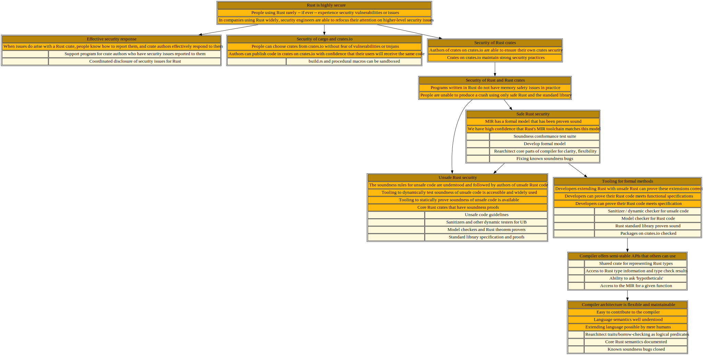

# 🎯 Rust is highly secure

## Shiny future

This page describes a tree of work that needs to be done in order to ensure that Rust is *highly secure*, meaning that people using Rust rarely -- if ever -- experience security vulnerabilities or issues. As a consequences of having fewer security vulnerabilities, companies will then be able to refocus the resources they used to devote to fuzzing and other "small scale" prevention measures on adopting higher-level security guarantees.

## Status quo as of January 2022

Unfortunately, though, a fair bit of work remains before we have realized that vision. 

At the core level, the compiler and language have a number of known soundness bugs. Much of Rust's core libraries are based around unsafe code, but we lack definitive rules for what unsafe code is allowed to do, to say nothing of effective tooling for checking that code follows those rules. Rust's support for formal verification is also less advanced than other languages, and hindered by the lack of a clear semantics. 

Like most modern langauges, Rust offers a rich ecosystem of libraries called crates. These crates are readily accessible on crates.io. Other packaging systems, however, have suffered from high-profile examples of trojan horses or malicious packaging, and crates.io has few defenses against that sort of thing. Users frequently report difficulty in selecting the right crate from the many choices available. Rust's packaging tool and language design includes a number of potentially unexpected vectors through malicious code can be incorporated, such as the build.rs preprocessing step or procedural macros.

<a href="security.svg">
</img>
</a>