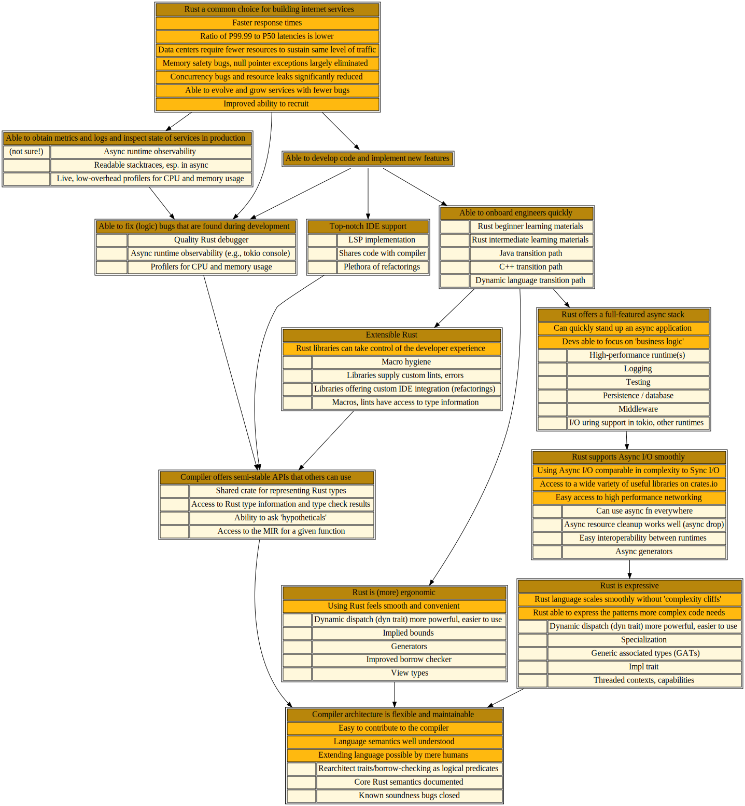

# 🎯 Rust widely used to build internet services

## Shiny future

This page describes a tree of work that aims to make Rust an excellent choice for building internet services. These services are the backbone of the internet today. Since they support so much traffic, service authors highly value both peak performance but also predictability. Rust is a good choice here because it offers performance comparable to C++ without the high tail latencies and variablity typically introduced by garbage collectors. Rust also offers stronger safety guarantees even than garbage collected languages like Java or Go, since its type system rules out data races. Furthermore, Rust's focus on reliability winds up producing fewer bugs overall, resulting in less time spent responding to customer issues and more time creating compelling features. Finally, because people love using Rust, teams find that they are able to recruit quality engineers more easily.

## Status quo as of January 2022

In practice, though, Rust today has several shortcomings that can make it a less appealing choice. Other languages offer stronger tooling for debugging development systems and monitoring production systems. Rust's current learning curve means that new developers, especially those who are less experienced overall, have a harder time coming up to speed. Even once people are accustomed to using Rust, they typically spend more time figuring out how to encode something in Rust than they would if they were using some other language.

Async Rust, which uses user-space primitives to manage concurrency rather than relying on the kernel, is of particular importance in this domain. Unfortunately, it is also one of the areas where Rust needs the most work. Expressing common patterns in Async Rust require the type system to be extended in non-trivial ways (even if users will ultimately not have to be aware of those extensions), which in turn requires improving the compiler's implementation (which is having trouble scaling to that )

<a href="service-author.svg">
</img>
</a>